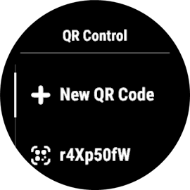
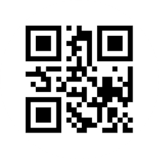

# 
        GoPro QR Control for Garmin  

A ConnectIQ widget which can generate QR codes to control a Labs enabled GoPro camera (more info about GoPro Labs on the [official website](https://gopro.com/fr/fr/info/gopro-labs) and their [GitHub page](https://gopro.github.io/labs/control/)). Heavily inspired from the QR Control app on Android and Massimo Artizzu's "Let's develop a QR Code Generator" [blog post series](https://dev.to/maxart2501/let-s-develop-a-qr-code-generator-part-i-basic-concepts-510a)

## Features
- generates QR codes directly on the watch
- selecter for all video settings
- selecter for all protune settings
- selecter for most of the labs extended controls
- save qr codes for faster loading

## Installation
The widget probably won't be available on the [Garmin Connect IQ store](https://apps.garmin.com/apps/3d483b55-7a79-4fad-a6cc-aa8ce19924e1) because according to GoPro, "Labs is an experimental platform and is not to be consumer facing". Thus, you will have to install (side-load) it from the GitHub released iq file or to build it yourself from the source. Instructions for the latter are provided in Garmin's [documentation](https://developer.garmin.com/connect-iq/connect-iq-basics/).

### Install from a GitHub release
1. Download [latest release](https://github.com/ad220/gopro-qr-control-connectiq/releases/latest) from GitHub
2. Connect your watch to your computer using a USB cable
3. Find your device in Garmin's [Device Reference](https://developer.garmin.com/connect-iq/device-reference/)
4. Scroll down to "Part Number" and write it down
5. Unzip the .iq release file (it works with 7Zip)
6. Open the folder named after your part number
7. Copy the .prg file to your device's "GARMIN/APPS" directory

## How to use it
The user interface is pretty straight-forward: press new qr code to enter the settings menu. There you can select any setting to pass to the gopro when it will scan the qr code. Generating the first qr code after starting the app takes a bit longer than the next ones. On my end with a Forerunner 955, it never took longer than 15 seconds. Once generated, you can save the code so that it will almost show up instantly next time you need it.

You can tweak the following settings on the main menu:
- **Force smallest code:** if enabled, the app will generate only the smallest kind of QR codes so that pixels appear bigger on the small watch display and thus being easier to scan for the camera.
- **Use new XC prefixes:** enables the use of the new extended controls prefixes which can only be used for new cameras from HERO10 onward.
- **Use automatic params order:** reorders the labs commands automatically to avoid impossible settings combination (but could also prevent some advanced behaviors).

All the different parameters should be described in [doc/LABS.md](doc/LABS.md), which is an extract of the [official GoPro Labs technical documentation](https://github.com/gopro/labs/tree/master/docs/control/tech).

## Screenshot gallery

## Changelog

### v1.3
- Add glance view

### v1.2
- Fix removing a saved qr code
- Fix qr code loading for older devices

### v1.1
- Fix logo color and crash on QR code generation for older devices

### v1.0
- First version of the app